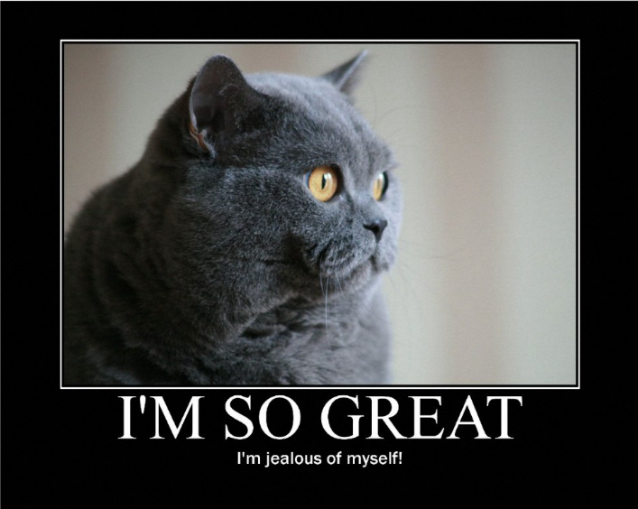
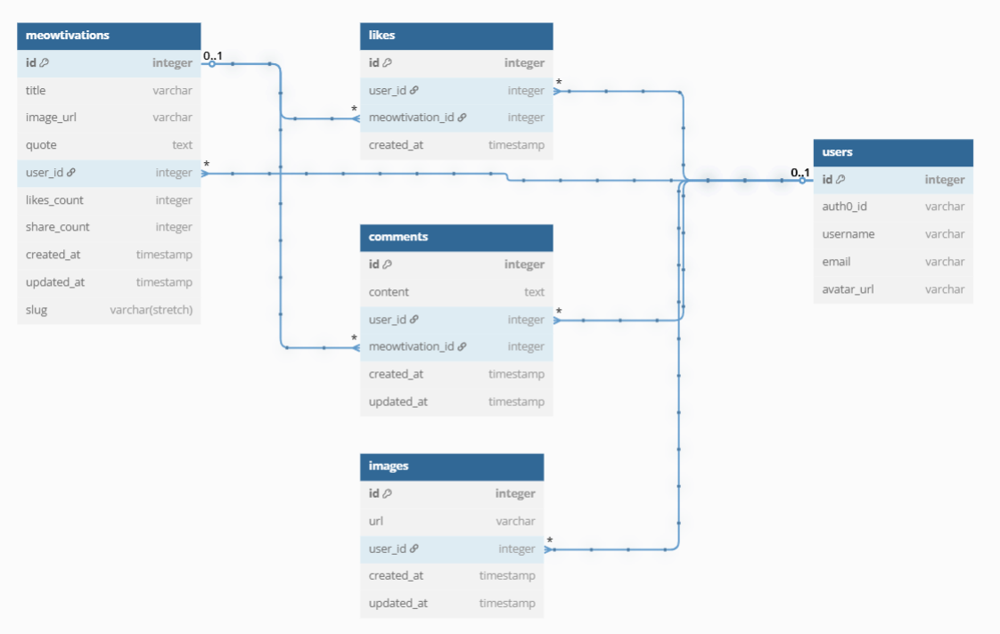

# Meowtivation - Pet Profile Directory

A social platform for pet users to create meowtivationals, browse the gallery, and connect with fellow cat enthusiasts.



## Project Overview

Meowtivation is a full-stack application that allows users to:
- Browse meowtivationals profiles
- View random meowtivationals
- Create and manage profiles
- like meowtivationals
- comment
- And more!

## Setup

### 0. Cloning and installation

- [ ] Clone this repo, navigate to it, install packages, and start the server with `npm run dev`
  <details style="padding-left: 2em">
    <summary>Tip</summary>

    You may also want to start a new branch
    ```sh
    cd pet-bet
    npm i
    git checkout -b <branchname>
    npm run dev
    ```
  </details>

<details>
  <summary>More about using <code>npm</code> vs <code>npx</code></summary>

  - When running knex, run `npm run knex <command>`, e.g. `npm run knex migrate:latest` rather than using `npx`
</details>

---

## Building Blocks
---

### 1. Our tech stack

#### Core

- React, React Query, React Router
- Tailwind CSS, PostCSS
- Express, SuperAgent
- Knex, SQLite3
- Vite, TypeScript

#### Testing

- Vitest
- Testing Library 
- Supertest 
- Nock 

#### With extras from

- FontAwesome
- RadixUI, Headless UI React, Heroicons

#### Styling Utilities

The project includes a modernized styling setup with:
- Enhanced Tailwind configuration with additional animations and utilities
- Component classes for common UI elements (.card, .btn, .input)
- A modern CSS reset for better cross-browser consistency
- Noctis color theme variables

#### Recommended Extensions

- Tailwind CSS IntelliSense
- PostCSS Language Support
- ESLint
- Prettier

### 2. Our DB Schema



```sql
Table meowtivations {
  id integer [pk]
  title varchar
  image_url varchar
  quote text
  user_id integer [ref: > users.id]
  likes_count integer
  share_count integer
  created_at timestamp
  updated_at timestamp
  slug varchar (stretch)
}

Table comments {
  id integer [pk]
  content text
  user_id integer [ref: > users.id]
  meowtivation_id integer [ref: > meowtivations.id]
  created_at timestamp
  updated_at timestamp
}

Table users {
  id integer [pk]
  auth0_id varchar
  username varchar
  email varchar
  avatar_url varchar
}

Table likes {
  id integer [pk]
  user_id integer [ref: > users.id]
  meowtivation_id integer [ref: > meowtivations.id]
  created_at timestamp
}

Table images {
  id integer [pk]
  url varchar
  user_id integer [ref: > users.id]
  created_at timestamp
  updated_at timestamp
}
```

## User Stories

#### MVP

Feature 1: Random Cat Image Suggestions API
As a creator, I want to access a diverse collection of random cat images from an external API so that I can create engaging and varied meowtivational content.

Feature 2: Motivational Quote Generation with Gemini
As a creator, I want to generate inspiring motivational quotes using AI technology so that I can pair them with cat images to create meaningful and impactful meowtivations.

Feature 3: Meowtivation Card Component
As a user, I want to view meowtivations in a visually appealing card format that maintains consistent styling and adapts to different screen sizes so that I can enjoy a polished viewing experience.

Feature 4: Create Meowtivation
As a creator, I want to combine cat images with inspirational quotes to create new meowtivations, with the ability to preview my creation before sharing it with the community.

Feature 5: Single Meowtivation View
As a user, I want to view individual meowtivation cards in full detail so that I can appreciate the image and quote combination and engage with the content through likes and comments.

Feature 6: Authentication & Authorization
As a user, I want to securely log in to create and interact with content so that my contributions are properly attributed and my data is protected.

#### Stretch Goals
Feature 7: Like Functionality
As a user, I want to like meowtivations that resonate with me and see how many others have liked them so that I can express appreciation and get immediate feedback.

Feature 8: Comments
As a community member, I want to share my thoughts on meowtivations through comments so that I can engage in conversation and connect with others.

Feature 9: Community Feed
As a community member, I want to browse a feed of meowtivations created by others and sort them by recent or popular so that I can easily discover inspiring content.

Feature 10: User Profile Management
As a new user, I want to set up my profile after registration so that I can personalize my experience and have my information displayed alongside my creations.

Feature 11: User Collections
As a user, I want to view all the meowtivations I’ve created and liked in one place so that I can easily revisit my favorite content and track my contributions.

Feature 12: Image Upload
As a creator, I want to upload my own cat images with a preview so that I can use personal content in meowtivations and ensure it displays well before publishing.

Feature 13: Download & Share
As a user, I want to download meowtivations I like and share them with friends via unique links so that I can spread inspiration outside the platform.

## API Routes

### 🐾 Meowtivations Collection (`/api/v1/meowtivations`)

| Method | Endpoint                | Description                            | 
|--------|-------------------------|----------------------------------------|
| GET    | `/`                     | Get meowtivations feed                 |
| POST   | `/`                     | Create new meowtivation                |
| GET    | `/:id`                  | Get single meowtivation                |
| GET    | `/images/random`        | Get random cat image                   |
| GET    | `/quotes/random`        | Get AI-generated quote                 |
| PATCH  | `/:id/like`             | Toggle like on a meowtivation          |
| POST   | `/:id/comments`         | Add a comment                          |
| GET    | `/:id/comments`         | Get comments for a meowtivation        |

### 👤 Users Collection (`/api/v1/users`)

| Method | Endpoint                    | Description                             |
|--------|-----------------------------|-----------------------------------------|
| GET    | `/:id/profile`              | Get user profile                        |
| POST   | `/:id/profile`              | Create or update user profile           |
| GET    | `/:id/meowtivations`        | Get meowtivations created by user       |
| GET    | `/:id/likes`                | Get meowtivations liked by user         |

### 🔐 Auth Collection (`/api/v1/auth`)

| Method | Endpoint      | Description                     |
|--------|---------------|----------------------------------|
| GET    | `/me`         | Get current authenticated user   |

### 📸 Images Collection (`/api/v1/images`)

| Method | Endpoint      | Description               |
|--------|---------------|---------------------------|
| POST   | `/upload`     | Upload custom image       |

### 🔗 Share Collection (`/api/v1/share`)

| Method | Endpoint       | Description                        |
|--------|----------------|------------------------------------|
| GET    | `/:slug`       | Get shareable meowtivation by slug |
